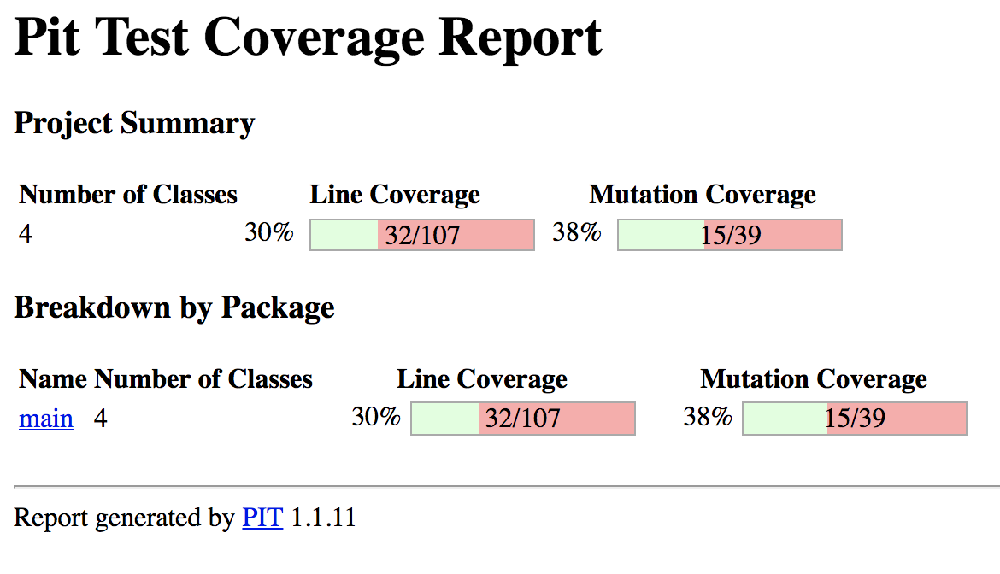
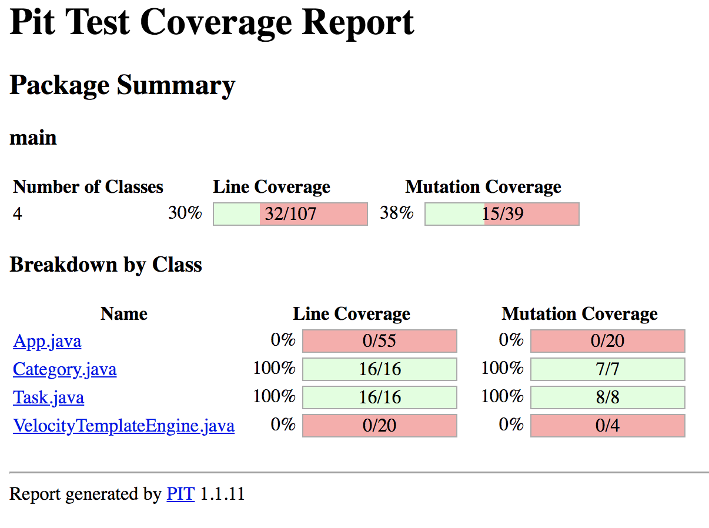
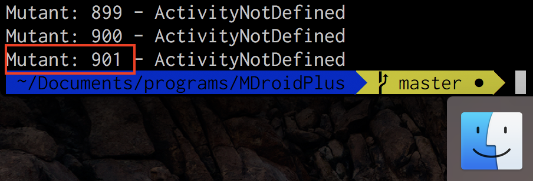
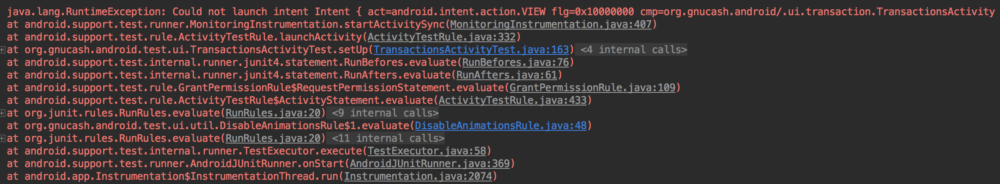
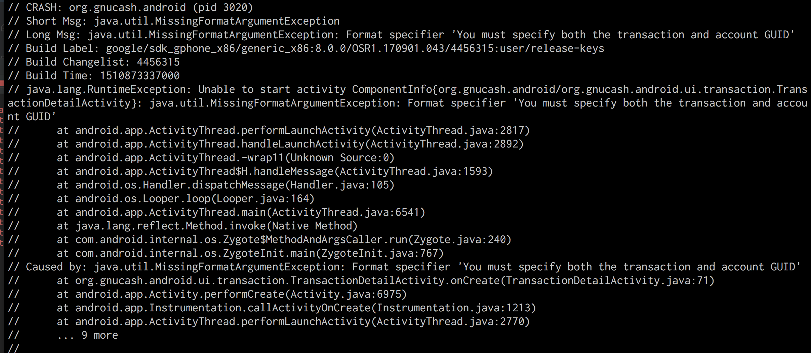
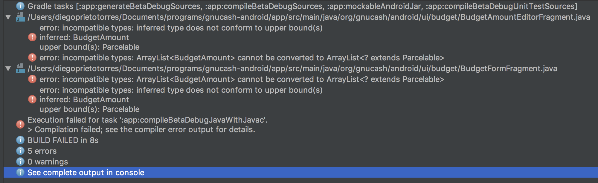

## Pitest

Reportes generados





## MDROID+

### GNU_CASH

---

#### Aplicación Original

|Tipo de Prueba     |Cantidad de pruebas codificadas|Cantidad de pruebas que pasan|
|--|--|--|
|Interfaz Gráfica   |37|35|
|Unitaria           |137|137|

Las pruebas de UI no son estables la aplicacion 

**Random Testing:** Para todas las instancias del `apk` de GNU Cash se va a realizar una prueba de random testing usando el comando base del monkey de Android `./adb shell monkey -p org.gnucash.android -v 1000000`. La ejecucuión sobre la aplicación original no logro detener la ejecución de la aplicación o encontrar errores.

**Mutantes:** Se usaron todos los operadores de mutación excepto el 23. El comando para generar los mutantes fue

`java -jar target/MDroidPlus-1.0.0.jar libs4ast/ /Users/Documents/programs/gnucash-android/app/src/main/ gnucash tmp/mutants/ . true`



---

#### Aplicación con Mutante 1

`Mutant 57: /Users/Documents/programs/gnucash-android/app/src/main/java/org/gnucash/android/ui/transaction/TransactionsListFragment.java; InvalidKeyIntentPutExtra in line 174`

`intent.putExtra("83480a2e5ec74d43a247cee205dc7275", mAccountUID);`

|Tipo de Prueba     |Cantidad de pruebas originales que pasan|Cantidad de pruebas que pasan con la mutación|
|--|--|--|
|Interfaz Gráfica   |35|28|
|Unitaria           |137|137|

**Pruebas de Unitarias:** Las pruebas unitarias no detectaron el mutante.

**Pruebas de Interfaz Gráfica:** Las pruebas de interfaz gráfica detectaron y eliminaron al mutante.



**Random Testing:** El random Testing detecto el mutante.



---

#### Aplicación con Mutante 2

`Mutant 144: /Users/Documents/programs/gnucash-android/app/src/main/java/org/gnucash/android/db/BookDbHelper.java; InvalidFilePath in line 169`

`src = new File("a6a7563e784d4fd1abd446792b381b04");`

|Tipo de Prueba     |Cantidad de pruebas originales que pasan|Cantidad de pruebas que pasan con la mutación|
|--|--|--|
|Interfaz Gráfica   |35|35|
|Unitaria           |137|137|

**Pruebas de Unitarias:** Las pruebas unitarias no detectaron el mutante.

**Pruebas de Interfaz Gráfica:** Las pruebas de interfaz gráfica no detectaron el mutante.

**Random Testing:** El random Testing también detecto el mutante

---

#### Aplicación con Mutante 3

`Mutant 184: /Users/Documents/programs/gnucash-android/app/src/main/java/org/gnucash/android/ui/account/AccountFormFragment.java; BuggyGUIListener in line 307`

`mColorSquare.setOnClickListener(null);  		return view;`

|Tipo de Prueba     |Cantidad de pruebas originales que pasan|Cantidad de pruebas que pasan con la mutación|
|--|--|--|
|Interfaz Gráfica   |35||
|Unitaria           |137|137|

**Pruebas de Unitarias:** Las pruebas unitarias no detectaron el mutante.

**Pruebas de Interfaz Gráfica:** Las pruebas de interfaz gráfica no detectaron el mutante.

**Random Testing:** El random Testing también detecto el mutante

---

#### Aplicación con Mutante 4

`Mutant 232: /Users/Documents/programs/gnucash-android/app/src/main/java/org/gnucash/android/ui/homescreen/WidgetConfigurationActivity.java; LengthyGUICreation in line 85`

```java
@Override
        public void onCreate(Bundle savedInstanceState) {
 try {
Thread.sleep(10000);
} catch (InterruptedException e) {
e.printStackTrace();
}
```

|Tipo de Prueba     |Cantidad de pruebas originales que pasan|Cantidad de pruebas que pasan con la mutación|
|--|--|--|
|Interfaz Gráfica   |35||
|Unitaria           |137|137|

**Pruebas de Unitarias:** Las pruebas unitarias no detectaron el mutante.

**Pruebas de Interfaz Gráfica:** Las pruebas de interfaz gráfica no detectaron el mutante.

**Random Testing:** El random Testing también detecto el mutante

---

#### Aplicación con Mutante 5

`Mutant 854: /Users/Documents/programs/gnucash-android/app/src/main/java/org/gnucash/android/ui/common/BaseDrawerActivity.java; NullIntent in line 247`

`Intent intent = null;`

|Tipo de Prueba     |Cantidad de pruebas originales que pasan|Cantidad de pruebas que pasan con la mutación|
|--|--|--|
|Interfaz Gráfica   |35||
|Unitaria           |137|137|

**Pruebas de Unitarias:** Las pruebas unitarias no detectaron el mutante.

**Pruebas de Interfaz Gráfica:** Las pruebas de interfaz gráfica no detectaron el mutante.

**Random Testing:** El random Testing también detecto el mutante

---

#### Aplicación con Mutante 6

`Mutant 249: /Users/Documents/programs/gnucash-android/app/src/main/java/org/gnucash/android/model/BudgetAmount.java; NotParcelable in line 1`

|Tipo de Prueba     |Cantidad de pruebas originales que pasan|Cantidad de pruebas que pasan con la mutación|
|--|--|--|
|Interfaz Gráfica   |35||
|Unitaria           |137||

**NACIDO MUERTO**

```java
ArrayList<BudgetAmount> budgetAmounts = getArguments().getParcelableArrayList(UxArgument.BUDGET_AMOUNT_LIST);
```



---

#### Aplicación con Mutante 7

`Mutant 264: /Users/diegoprietotorres/Documents/programs/gnucash-android/app/src/main/java/org/gnucash/android/ui/report/sheet/BalanceSheetFragment.java; FindViewByIdReturnsNull in line 157`

```java
TextView accountBalance = (TextView) null;
```

|Tipo de Prueba     |Cantidad de pruebas originales que pasan|Cantidad de pruebas que pasan con la mutación|
|--|--|--|
|Interfaz Gráfica   |35||
|Unitaria           |137|137|

**Pruebas de Unitarias:** Las pruebas unitarias no detectaron el mutante.

**Pruebas de Interfaz Gráfica:** Las pruebas de interfaz gráfica no detectaron el mutante.

**Random Testing:** El random Testing también detecto el mutante

---

#### Aplicación con Mutante 8

`Mutant 295: /Users/diegoprietotorres/Documents/programs/gnucash-android/app/src/main/java/org/gnucash/android/ui/export/ExportFormFragment.java; InvalidDate in line 383`

```java
final Date date = new Date(-649205281027L);
```

|Tipo de Prueba     |Cantidad de pruebas originales que pasan|Cantidad de pruebas que pasan con la mutación|
|--|--|--|
|Interfaz Gráfica   |35||
|Unitaria           |137|137|

**Pruebas de Unitarias:** Las pruebas unitarias no detectaron el mutante.

**Pruebas de Interfaz Gráfica:** Las pruebas de interfaz gráfica no detectaron el mutante.

**Random Testing:** El random Testing también detecto el mutante

---

#### Aplicación con Mutante 9

`Mutant 395: /Users/diegoprietotorres/Documents/programs/gnucash-android/app/src/main/java/org/gnucash/android/ui/budget/BudgetListFragment.java; DifferentActivityIntentDefinition in line 177`

```java
Intent addAccountIntent = new Intent(getActivity(),org.gnucash.android.ui.transaction.TransactionsActivity.class);
```

|Tipo de Prueba     |Cantidad de pruebas originales que pasan|Cantidad de pruebas que pasan con la mutación|
|--|--|--|
|Interfaz Gráfica   |35||
|Unitaria           |137|137|

**Pruebas de Unitarias:** Las pruebas unitarias no detectaron el mutante.

**Pruebas de Interfaz Gráfica:** Las pruebas de interfaz gráfica no detectaron el mutante.

**Random Testing:** El random Testing también detecto el mutante

---

#### Aplicación con Mutante 10

`Mutant 454: /Users/diegoprietotorres/Documents/programs/gnucash-android/app/src/main/java/org/gnucash/android/ui/settings/GeneralPreferenceFragment.java; NullValueIntentPutExtra in line 87`

```java
passIntent.putExtra(UxArgument.DISABLE_PASSCODE,new android.os.Parcelable[0]);
```

|Tipo de Prueba     |Cantidad de pruebas originales que pasan|Cantidad de pruebas que pasan con la mutación|
|--|--|--|
|Interfaz Gráfica   |35||
|Unitaria           |137|137|

**Pruebas de Unitarias:** Las pruebas unitarias no detectaron el mutante.

**Pruebas de Interfaz Gráfica:** Las pruebas de interfaz gráfica no detectaron el mutante.

**Random Testing:** El random Testing también detecto el mutante

---
